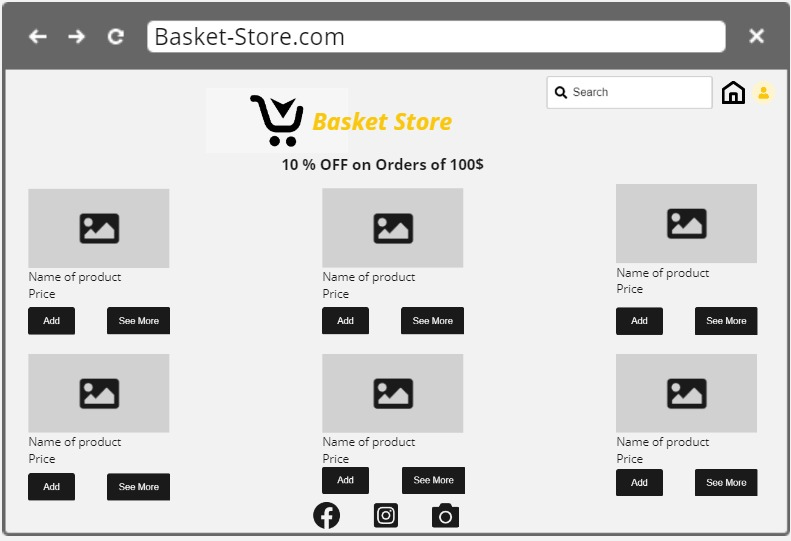
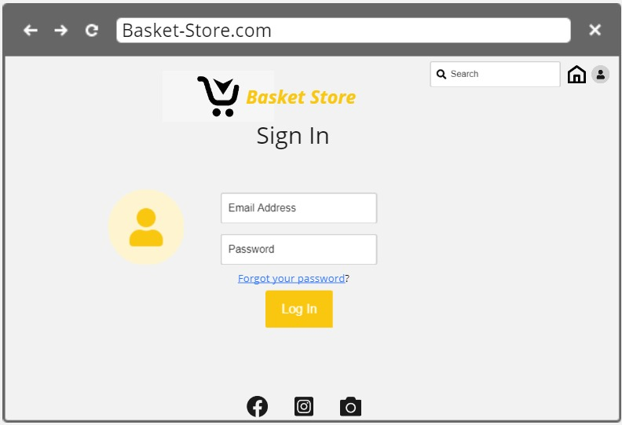
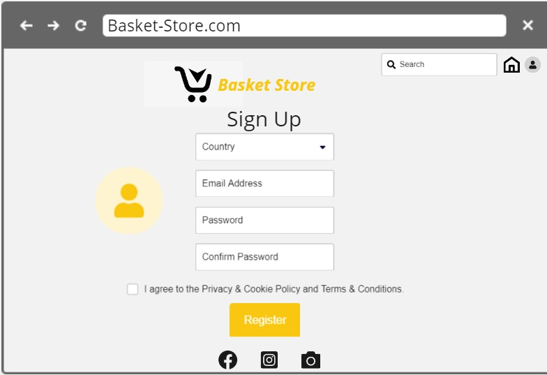
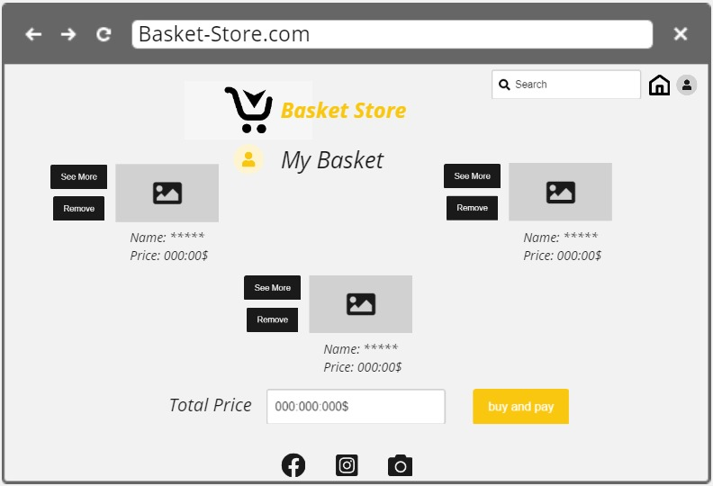
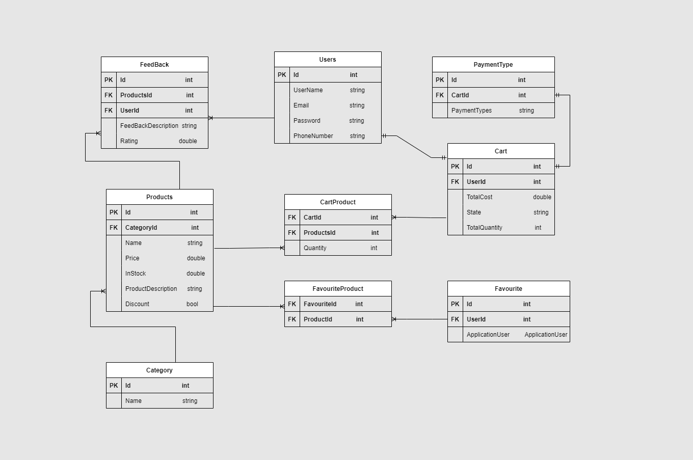

# Basket-Stores-MS

## Team members

- Mohammad Sarayrah (Team leader)
- Islam Alsawaftah
- Alaaldin alhanini
- Hanan Nathem Saadeh
- Yahia Khalil

## Introduction

This is an e-commerse website build for selling of any products online. In this project we have mainly considered to adding the products to the users cart and again let them decide the amount of item to buy. The users can increase or decrease the items amount in the cart. After that the user may pay and get the order successful. The Project also uses the mail facilities to the users.

# Problem Domain

With the rapid progress and development of technology and communication, we have to ensure that we automate all ideas and creative projects we may have, we should keep track with the updates happen everyday in the world of technology field, besides these days all activities should be done quickly.

from this point and because we belive that selling and buying is part and parcel in our life, it's an important operation we do every day, we decide to help people by creating an online website that they can sign up and  explore categories with all related products details like: name of product from which category does it came, and other informations customer may need to complete shopping operation, he/she will have a  message when they for example do something wrong like search for product we don't have and so on.

## Wireframes

- Home Page

- Login Page

- SignUp Page

- Cart Page 

## User Stories

1. As a new user, I want to register by creating a username and password so that the system can remember me and my data,
I should have a valid username and password to meet validation rules by the web application, and keep trying to fix register issues if occur until all validations take place.

2. As a registered user, I want to be able to securely log in to the system so that my information can only be accessed by me.
the system can authenticate me and I can trust it.

3. As a registered user, I want to be able to occasionally change my password so that I can keep it secure. and to be able to request a new password so that I don't permanently lose access to my data if I forget it.

4. As a registered user, I need to search for products, so that I can find the ones I want to buy and pass them to my cart, and be able to add feedback.

5. As an administrative user, I want to be able to show all users and their orders, so that I can know the status of each product

## Domain Modeling

Basket ER digram 

Product Table: 

- Have a primary key, and it has the fields of name, Price,InStock, description, and discount. Relationship is (many-to-one) with the  table Category, 

- Relationship:

- one to many with the table Cart

- one to many with the FeedBack table

Category Table: 

- Have a primary key, and it has the fields of name,

- Relationship:

-  is (one-to-many) with the table Product.

User Table :

- Have a Primary key , and it has filds of username,Email, Password,Phone number.

- Relationship :

- one to one relation with cart table.

- one to many relation with feedback table.

Payment Table: 

- Have a Primary key, and it has fields of payment type.

- Relationship : 

- a one to one relation with the cart table.

Cart Table :

- Have a primary key, and it has the fields of TotalCost,State and Totalquantity. 

- Relationship:

- one to one with users table.

- one to one with paymenttype table.

- many to many with products

Feeback table: 

- Join Table, have a Id as primary key , and it has the fields of UserId, ProductId, description,rating.

- Relationship:

- many-to-one with Users Table

- many-to-one with Products table

CartProduct table: 

- Join Table, have CartId an ProductId as forign keys, quantity. 

- Relationship:

- many-to-one with Products Table

- many-to-one with Cart table

FavouriteProduct table: 

- Join Table, have FavouriteId an ProductId as forign keys, quantity. 

- Relationship:

- many-to-one with Products Table

- many-to-one with Favourite table

Favourite: Have a primary Key, and it has the fields of User

- Relationship:

- many-to-one with FavouriteProduct table

# Functionalties 

1- Authentication

a- new user, should follow some validation rules to complete registration, and provide real data to be communicated.

b- logged in user, can be able to search for specific product, then add product to special cart it's just for authenticated users, each user will have own cart, user can add feedback for product.

c- logged in users can be able to reset password by providing email and new password.

2- Cart

consist of user's products that he/she want to buy, each user will have a unique id for his/her cart, it will count total cost for products inside it, we will know state of product if it delivered or still not delivered, and it will have quantity of products.
user can be able to see products inside his cart, update it, add product to cart so number will increase or delete from it number will be decreased.

3- Category

each product will belong to unique category, so user will be able to see what categories we have, and browse products inside this category, also he/she will see feedback from other user's on same product

4- Favourite 

each user will have a list of favourite products user add it, so he/she will return to it if he/she want to buy same product one more time, or he can just remove product from it in case he don't want it.

5- FeedBack

user can add feedback and rating on product, so other user's can have an overview if they willing to buy this pruct or no.

6- PaymentType

defenitly each cart will have a special payment type to complete shopping.

7- Products

when user explore products he/she can have multiple ways to browse it like:  ordered by (ascending, descending, min To max price and viceversa, from To price), ability to search for a specific product by name and description, we provide a detailed information about it like: name , price, product description , discount if exist, category for this product , feedback for given product

8- Testing

We use a unit tasting in our project by test some functions such as the function that responsible to add product to cart.

9- Send Bill details to the User Email.

10- Dayile Excel report sheet to Administrator

The administrator has the ability to create a daily excel report.
