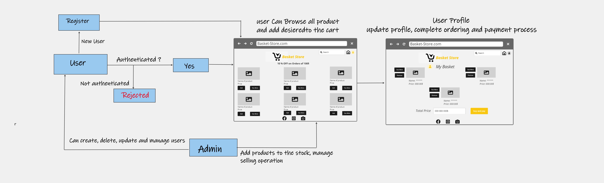

# Software Requirements

## Vision

- What is the vision of this product?

Our vision for our product is to make e-commerce easier and faster, it will be a web application that is really helpful and smooth.the user can easily see and choose any product he wants, he can remove from his basket and finally can buy and pay.

Product quality describes a product’s capability to meet user standards. Here are some questions to consider when evaluating a product’s quality:

- Does it solve a problem? 

No product would exist if it weren’t solving or improving something. The extent to which it fixes the intended problem helps to determine its quality.

- Is it easy to use?

A high-quality product shouldn’t be complicated to use. Customers shouldn’t have to spend too much time trying to figure out how to assemble or work it.

- Is it polished? 

Colors, dimensions, fonts (if applicable) and other elements of design should be in alignment. The product shouldn’t appear cheap in any way.

Is it efficient?
 The product should not only get the job done but do so efficiently. In other words, it should deliver quickly and require minimal effort from the consumer.

Is it tailored to your customers?
The product should be tailored specifically to users’ needs, showing that you understand your customers and are willing to accept any recommendations they voice.

## Scope (In/Out)

IN - What will your product do

Describe the individual features that your product will do.
The web app will provide to user ability to online shoping 
The web app will provide add items to basket and multi way to pays. 
Users will be able to See the produts and add to basket what they need.

OUT - What will your product not do.
 My website will never turn into an IOS or Android app.

## Stretch goal

- Add new product
- Double website traffic
- wholesale products
- improvement User experience
- Improve productivity 
- Care about user feedback

## Functional Requirements:

- An admin can create and delete user accounts, add and delete products.
- An Admin can keep track the inventory, can have list of all products.
- A user can search all of the products in the inventory.
- A user can create an order.
- A user can change password if needed.

## Non-Functional Requirements:

- Security: Our project is secure and the data of the user will be private and it will not be shown to any other user, there is an authentication and authorization in our project, so we will manage to check who you are and what the rights that you have in this system.

- Usability: Our application is easy to use and anyone can use it without needing any help.

- password Encoder to hash users password.

- make the username uniqe.

